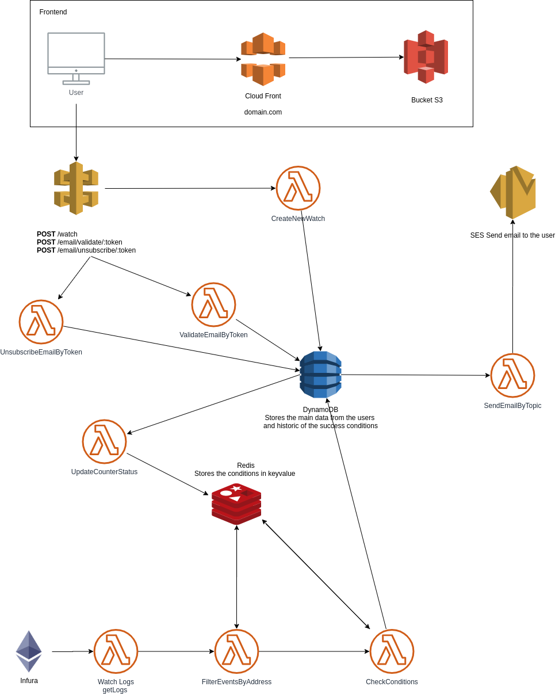

# Ethereum Event Monitoring

Frontend : https://gitlab.com/damarnez/events-monitoring-front



## Local environment

### Create .env.local file

```
URL_REDIS=172.28.1.4
URL_DYNAMODB=http://172.28.1.5:8000
URL_INFURA_01= https://network.infura.io/v3/INFURAKEY
URL_INFURA_02= https://network.infura.io/v3/INFURAKEY

```

### Start docker compose

With docker-compose we start the databases (Redis and DynamoDB) in local.

```
  docker-compose up
```

### Create tables in dynamodb

```
  npm run populate:dynamodb
```

### Start the lambdas

```
  npm run local
```

## Deploy production

### Pre deploy

Create a VPC where you have access to the Internet, and have access to Redis and Dynamodb. Also, you need to have the SES approved to send emails to other domains, you don't need to have access from inside of the VPC because the lambda SendEmailByTopic is outside of the VPC.

### Create .env file

```
URL_REDIS= URLREDIS
URL_DYNAMODB=http://172.28.1.5:8000
URL_INFURA_01= https://network.infura.io/v3/INFURAKEY
URL_INFURA_02= https://network.infura.io/v3/INFURAKEY

```

### Deploy

```
npm run deploy

```
